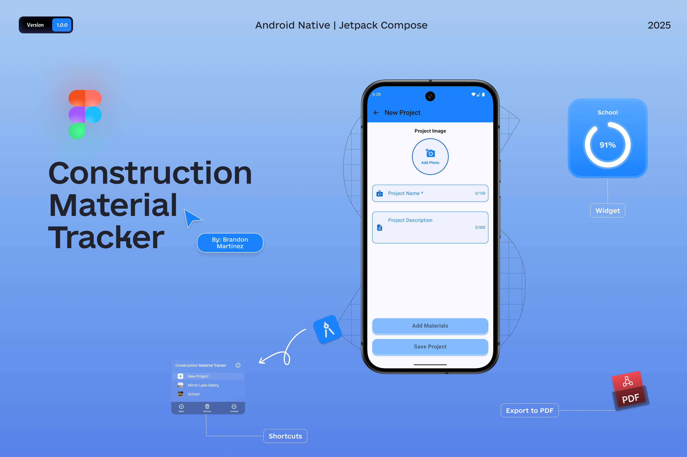
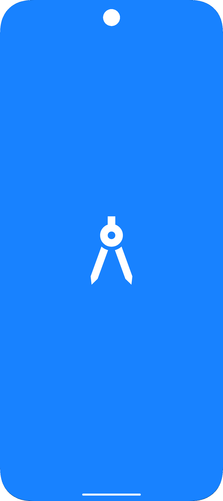
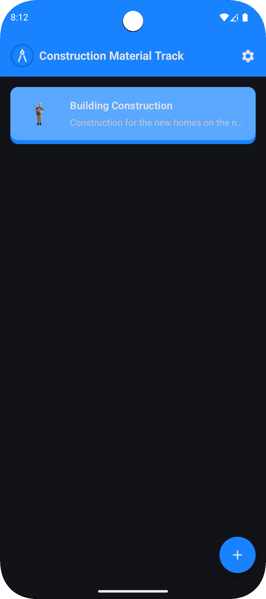
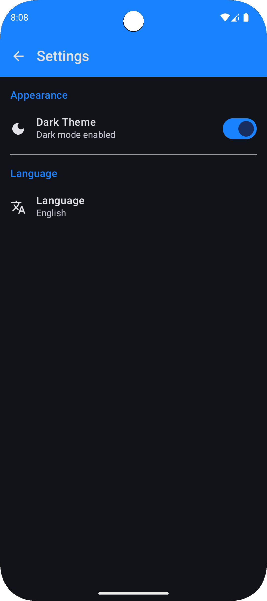
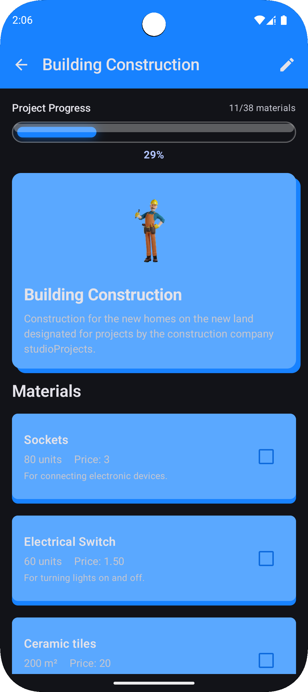
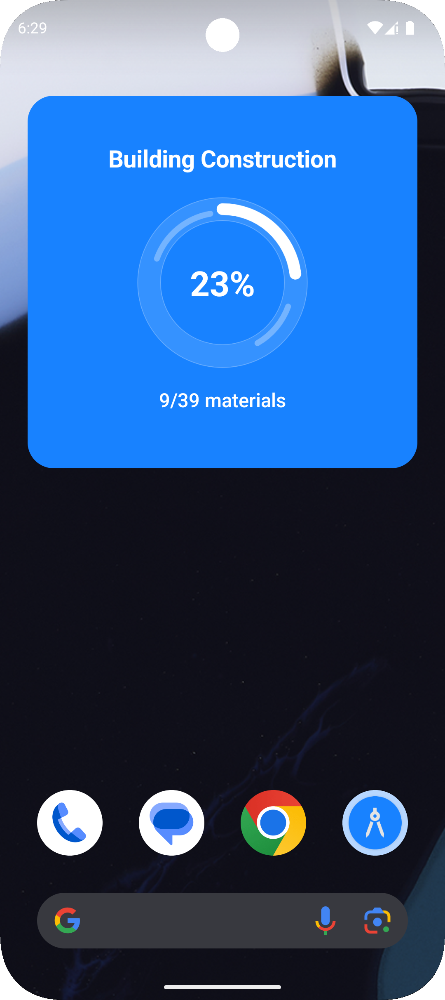
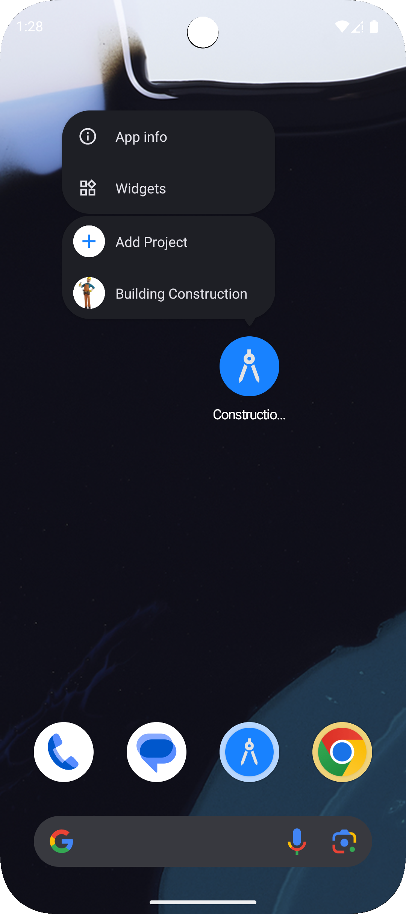
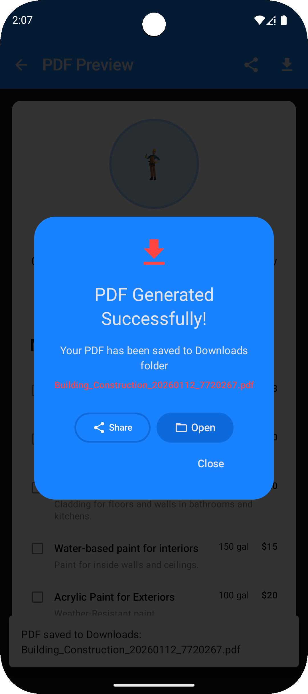
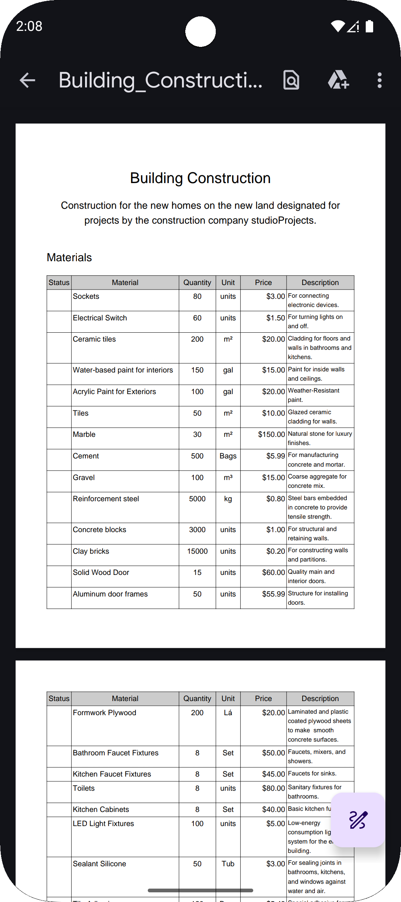

<p align="center">
  <a href="https://github.com/BR444N/Construction-Material-Tracker/blob/main/LICENSE">
    
  </a>
  
  
</p>

# 🏗️ Construction-Material-Tracker

**Construction Material Tracker** is an Android mobile application built with **Kotlin** and **Jetpack Compose**, designed to help architects and engineers manage **multiple construction projects** efficiently.

The app centralizes material tracking, cost control, and project reporting, providing a clear overview of each project and reducing errors caused by manual processes such as spreadsheets or paper notes.

---

## 📖 Table Contents

- [🏗️ Construction-Material-Tracker](#-construction-material-tracker)
- [⬇️ Download](#-download)
- [🙋‍♂️ Author](#-author)

---

# ✨ App Features

- 🌗 **Light & Dark Theme**  
  Supports both light and dark themes.

- 🌍 **Multi-language Support**  
  Localization support to provide a better experience for users in different regions.

- ⚡ **App Shortcuts**  
  Quick access shortcuts to:
    - Create a new project
    - Open the most recently viewed project directly from the launcher

- 🧩 **Home Screen Widgets**  
  Project progress widget that displays real-time material completion status and stays synchronized with in-app data.

- 🚀 **Splash Screen**  
  Smooth and consistent splash screen implementation following modern Android guidelines.

- 📷 **Camera & Gallery Integration**  
  Allows users to capture images using the device camera or select images from the gallery to associate with projects or materials.

- 📄 **PDF Export**  
  Generates structured PDF reports containing project materials and progress, ready to be shared with clients or stakeholders.

- 💡 **Tooltips & Contextual Guidance**  
  Tooltips and UI hints to guide users through key actions and improve usability without overwhelming the interface.

# 📸 Screenshots

<div align="center">

## Navigation Guide:
**Click on any screenshot to view it in a full size.**

### App Screens






### Widget y Shortcuts




### Reports and Media




</div>

# 🎯 Development Challenges

## 💡 From Problem to Solution

### **The Real Need**

Architects and engineers often manage **3–5 construction projects simultaneously**, relying on spreadsheets, paper notes, and disconnected tools to track materials, costs, and project requirements.

This fragmented workflow commonly leads to:
- Material miscalculations and budget overruns
- Limited visibility across multiple projects
- Time-consuming and error-prone manual reporting
- Difficulty sharing updated information with clients

### **Evolution of the Solution**

The application was intentionally designed to be **simple at its core**. The initial scope focused only on basic material tracking per project, without advanced features such as widgets, app shortcuts, camera integration or unit type handling.

As development progressed, limitations of this minimal approach became evident. Real usage scenarios revealed the need for better accessibility, faster interactions, and more flexible material management.

Features such as:
- **PDF report generation**
- **home screen widgets**
- **progress bar**
- **app shortcuts**
- **camera-based image capture**, and **support for multiple measurement units** (pcs, m, cm, in, ft, etc.) were added iteratively as practical solutions to these newly identified needs.

This approach mirrors real-world software development, where products evolve through iteration, feedback, and technical discovery rather than being fully defined from the start.

### Key Challenges Overcome

- **Home Screen Widget Data Persistence & Lifecycle**  
  One of the main challenges was managing widget data persistence and lifecycle. When a project linked to a widget was deleted, the widget needed to automatically handle this state by removing the reference and displaying a clear message prompting the user to select a new project.

- **App ↔ Widget Data Synchronization**  
  Ensuring consistent data between the app and widgets required careful state synchronization. For example, when a user added or updated materials inside the app, the widget had to immediately reflect the same progress and material status without inconsistencies.

- **App Shortcuts Context Management**  
  Implementing app shortcuts required tracking project navigation state to determine the most recently viewed project. When a shortcut was launched from the home screen, the app needed to open directly into the correct project context instead of a generic entry point.

- **State Management Across Multiple Entry Points**  
  The app can be launched from different entry points (launcher icon, widgets, shortcuts), each requiring correct project resolution and UI state restoration. Handling these flows reliably was a key architectural and UX challenge.

# Architecture & Technical Decisions 

The application is built using **Clean Architecture** combined with the **MVVM** pattern, following modern Android development best practices.

#### Architecture
**MVVM** was chosen as it is widely adopted in medium to large Android projects, allowing clear separation of concerns, improved code readability, and avoiding excessive logic inside UI components. This approach is especially valuable in real-world projects where new features are continuously introduced.

**Clean Architecture** was implemented with scalability and long-term maintainability in mind. The layered structure makes the codebase easier to understand for new team members and helps maintain a clear data flow, while also contributing to overall performance management.

#### State Management
Each screen has its own **ViewModel**, which exposes an immutable `UiState` using **StateFlow**.  
State is managed through private and public flows to ensure a controlled and predictable data stream to the UI, allowing Jetpack Compose to react efficiently to state changes.

#### Single Source of Truth
The local database **Room** acts as the **single source of truth** for the application.  
There is no data duplication in memory: all UI components, widgets, and shortcuts consume data directly from Room, ensuring consistency across the entire app.

#### Widgets
Widgets access data through repositories and read directly from the Room database.  
This guarantees that any change made inside the app, such as adding or removing materials, is immediately reflected in the widget.

When a project linked to a widget is deleted, orphan widget configurations are cleared, related cache data is removed, and the widget displays an informative state indicating that no project is currently selected.

#### App Shortcuts & Navigation
The app maintains up to **two dynamic shortcuts** for the most recently viewed projects.  
These shortcuts are ordered in descending order based on Room database data and are automatically updated whenever projects are created, opened, or deleted.

Although the app can be launched from multiple entry points (launcher icon, widgets, and shortcuts), navigation is centralized through the `MainActivity`, ensuring correct project resolution and UI state restoration.

#### Scalability & Maintainability
This architecture simplifies testing, supports future feature expansion, enables potential cloud synchronization, and helps maintain optimal application performance.


# 📦 Tech Stack

- **Kotlin**  
  Primary programming language used for Android development, leveraging modern language features for safer and more concise code.

- **Jetpack Compose**  
  Declarative UI framework used to build responsive and maintainable user interfaces.

- **Material 3**  
  Implements modern Material Design guidelines, ensuring visual consistency and accessibility across the app.

- **Jetpack Navigation (Navigation Compose)**  
  Manages in-app navigation and multiple entry points from widgets and app shortcuts.

- **Kotlin Coroutines**  
  Handles asynchronous operations and background tasks efficiently without blocking the UI.

- **Room**  
  Local persistence solution used to store projects, materials, and progress data.

- **Glance**  
  Used to build and manage Home Screen Widgets with consistent UI and real-time data synchronization.

- **SplashScreen API**  
  Implements a modern splash screen experience following Android platform guidelines.

- **Lottie**  
  Displays lightweight animations to enhance user experience and visual feedback.

- **Coil**  
  Efficient image loading library for handling images from the camera and gallery.

- **iText 7**  
  Generates structured and professional PDF reports directly on the device.

- **Material Icons Extended**  
  Provides an extended set of Material icons for richer and more expressive UI elements.

- **KSP (Kotlin Symbol Processing)**  
  Used for annotation processing to improve build performance and reduce compilation overhead.

# ⬇️ Download

```bash
git clone https://github.com/BR444N/Construction-Material-Tracker.git
```

1. Open the project in the latest version of Android Studio.

2. Wait for Gradle to sync all dependencies.

3. Run the application on an emulator or physical device.

# Future Improvements 

- ☁️ **Cloud Synchronization**  
  Synchronize projects and materials across multiple devices using a remote backend.

- 🔐 **User Authentication**  
  Add user accounts to enable secure access and personalized project data.

- 📊 **Advanced Project Analytics**  
  Provide detailed insights on material usage, costs, and progress over time.

- 🧾 **Customizable PDF Reports**  
  Allow users to configure report templates, branding, and exported data fields.

- 🔄 **Backup & Restore**  
  Enable local and cloud-based backups to prevent data loss.

- 📦 **Multi-user Collaboration**  
  Allow multiple users to collaborate on the same project with controlled access levels.

- 🧪 **Automated Testing Coverage**  
  Increase unit and UI test coverage to ensure long-term stability.

- ⌚ **Wear OS Companion App** *(optional)*  
  Provide quick project status and material progress directly from a smartwatch.

- 🌐 **Additional Localization Support**  
  Expand language support to reach a broader user base.


# 🙋‍♂️ Author
[BR444N](https://github.com/BR444N)

