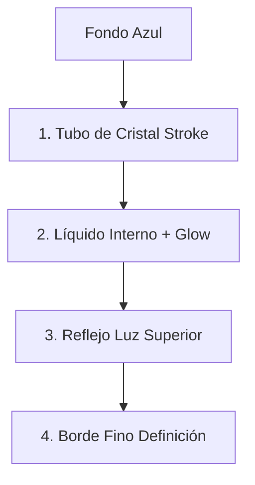

# Diseño de Barra de Progreso "Líquido en Cristal"

Este documento detalla la implementación técnica de la `GlassLinearProgressBar` usando Jetpack Compose Canvas. El efecto de profundidad y cristal se logra mediante la superposición de **4 capas de dibujo**.

## Concepto Visual

El objetivo es simular un tubo de ensayo de vidrio (`Glass Container`) acostado, que contiene un líquido blanco brillante (`Liquid`) en su interior.

## Colores Base (`theme/Color.kt`)

- **`GlassTrack`** (`#20FFFFFF`): El cuerpo del tubo de cristal. Muy transparente (12% opacidad).
- **`GlassReflection`** (`#50FFFFFF`): Reflejos de luz especular. Blanco semitransparente (31% opacidad).
- **`GlassShadow`**: Sombra sutil para dar volumen (no usada directamente en la barra lineal simplificada, pero parte del sistema).

## Capas de Dibujo (Canvas)

El dibujo se realiza en orden, desde el fondo hacia el frente:

### 1. El Contenedor de Cristal (Glass Container)

Define la forma del "tubo".

- **Forma**: Rectángulo redondeado (`RoundRect`).
- **Radio**: `height / 2` (para bordes completamente semicirculares).
- **Dibujo**: Se dibuja el contorno (`Stroke`) grueso con `GlassTrack`.
- **Efecto**: Crea las paredes gruesas del tubo.

```kotlin
drawPath(
    path = glassPath,
    color = GlassTrack,
    style = Stroke(width = 4.dp.toPx(), cap = StrokeCap.Round)
)
```

### 2. El Líquido (Liquid Progress)

Es el indicador de progreso real. Para que parezca estar _dentro_ del cristal, debe ser más pequeño que el contenedor.

- **Padding**: Se aplica un margen interno (`liquidPadding`) de aprox. 25% de la altura.
- **Ancho**: Calculado dinámicamente: `(anchoTotal - padding) * progreso`.
- **Efecto de Brillo (Glow)**: Usamos `nativeCanvas` y `Paint.setShadowLayer` para que el líquido "brille", simulando luz pasando a través del fluido.

```kotlin
liquidPaint.setShadowLayer(15f, 0f, 0f, Color.WHITE)
```

### 3. Reflejo Superior (Specular Highlight)

Simula la luz golpeando la superficie curva superior del tubo de vidrio.

- **Forma**: Rectángulo redondeado más pequeño en la parte superior (0% a 40% de la altura).
- **Color**: `GlassReflection`.
- **Efecto**: Da la sensación de volumen cilíndrico. Sin esto, la barra parecería plana.

### 4. Bordes de Profundidad (Depth Borders)

Un trazo fino adicional sobre el cristal para definir mejor los bordes contra fondos claros u oscuros.

- **Color**: Blanco al 30% de opacidad.
- **Estilo**: `Stroke` fino (2dp).

## Diagrama de Capas



## Ejemplo de Código Simplificado

```kotlin
Canvas(modifier = Modifier.fillMaxSize()) {
    // 1. Cristal
    drawRoundRect(color = GlassTrack )

    // 2. Líquido (Nativo para sombra)
    drawContext.canvas.nativeCanvas.drawRoundRect()

    // 3. Reflejo
    drawPath(path = reflectionPath, color = GlassReflection)
}
```
